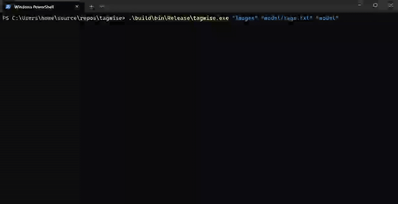

# tagwise

Tagwise is a command-line tool that automatically analyzes images with a CLIP-based ONNX model to find the most relevant keywords from a predefined vocabulary. It then renames each image file with the top predicted tags and its modification timestamp for easier search, organization, and sharing.

## Models and Data
```
cd tagwise
git clone https://huggingface.co/mahyaret/tagwise ./model 
```

## Build on Windows

```
cd C:\\Users\\home\\source\\repos\\tagwise

cmake -B build -S . -G "Visual Studio 17 2022" -A x64
cmake --build build --config Release
```

## How to run
```
.\tagwise.exe "[path_to_images_folder]" "[path_to_tags.txt]" "[path_to_model]"
```


## Demo

